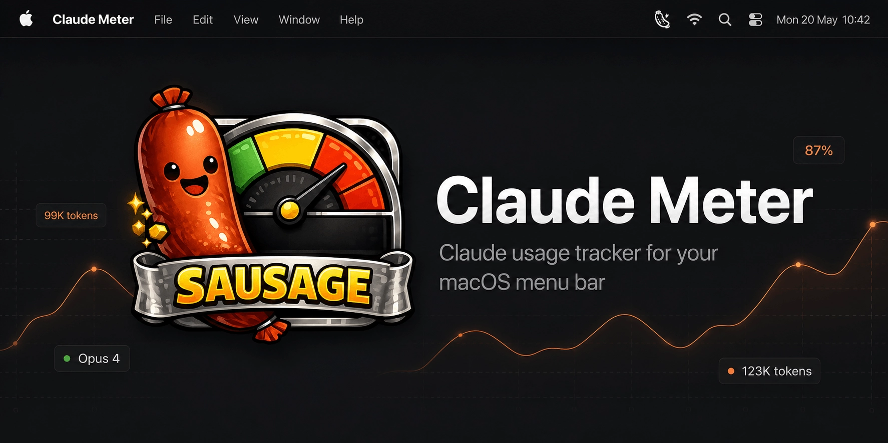

# Sausage

A lightweight macOS menu bar app that tracks your **Claude Max** token usage in real time — so you always know how much of your 5-hour block you've burned through.

## Features

- **Live token counter** in the menu bar with color-coded usage ring (green → yellow → red)
- **Current block** — tokens used, estimated cost, time remaining, and model breakdown
- **Today & 7-day sparkline** — quick overview of daily usage patterns
- **Weekly stacked bar chart** — per-day breakdown by model (Opus / Sonnet / Haiku)
- **90-day activity heatmap** — GitHub-style calendar of your usage history
- **Top projects** — which Claude Code projects consumed the most tokens this week
- **Admin API integration** — connect your Anthropic Admin API key to see real API spend data
- **Right-click context menu** — Settings and Quit directly from the icon
- Credentials stored securely in the **macOS Keychain**
- Auto-launches at login via LaunchAgent

## Requirements

- macOS 14 Sonoma or later
- [`ccusage`](https://github.com/ryoppippi/ccusage) CLI installed (`npm install -g ccusage`)
- A Claude Max subscription (20x plan recommended)

## Installation

### Build from source

```bash
git clone https://github.com/therealpan/sausage.git
cd sausage
bash Scripts/build-app.sh
open dist/Sausage.app
```

### Auto-start at login

```bash
bash Scripts/install-launchagent.sh
```

## Usage

1. Click the sausage icon in the menu bar to open the usage panel
2. Right-click the icon for quick Settings / Quit access
3. Optionally add an **Anthropic Admin API key** in Settings to unlock API spend tracking

## How it works

Token and session data is read from `ccusage`, a local CLI tool that parses Claude's usage logs. No data is sent anywhere — everything runs locally. The Admin API feature is optional and uses the official Anthropic API with your own key.

## License

MIT
